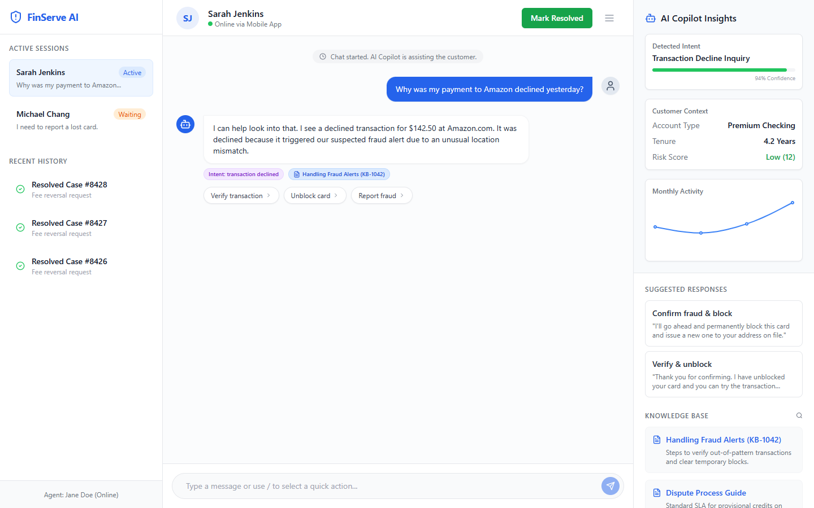

# AI Banking Support Copilot

## Product Overview
The **AI Banking Support Copilot** is an intelligent assistant designed for customer service agents in the financial sector. It acts as an intermediary between the customer and the bank's knowledge base, providing real-time intent classification, suggested responses, and automated resolution workflows. The goal is to enhance agent productivity, reduce average handle time (AHT), and improve customer satisfaction (CSAT) by resolving inquiries faster and more accurately.

## Why I Built This
Customer support in banking is historically slow, heavily reliant on legacy knowledge bases, and plagued by high agent turnover. Customers want instant answers for declined transactions, missing transfers, and dispute filings. I built this product to demonstrate how generative AI can augment—not entirely replace—human agents, ensuring safety and compliance in a highly regulated industry while drastically improving efficiency.

## Problem Statement
Banking customers frequently face high-anxiety situations (e.g., declined cards, unrecognized charges) and expect immediate resolution. However, support agents often struggle to navigate disjointed systems (CRM, Knowledge Base, Transaction Ledger) while keeping the customer engaged. This leads to long wait times, inaccurate responses, and high operational costs.

## Target Users
- **Tier 1 Support Agents:** Handling frontline inquiries and standard account operations.
- **Tier 2/Escalation Agents:** Managing complex disputes or fraud cases.
- **Support Managers:** Monitoring metrics, CSAT, and agent efficiency.

## User Personas
1. **Sarah (Customer):** 34, busy professional. Her card was declined at checkout. She needs immediate unblocking.
2. **Alex (Tier 1 Agent):** 24, new hire. Overwhelmed by the 50+ knowledge base articles on fraud alerts. Needs quick, accurate guidance.
3. **Priya (Support Manager):** 41. Focused on reducing AHT and escalation rates while maintaining compliance.

## Product Goals
- Reduce Average Handle Time (AHT) by 40%.
- Deflect 30% of tier 1 tickets through automated resolutions before agent handoff.
- Increase First Contact Resolution (FCR) rate by providing agents with the right context immediately.

## Hypothesis
If we provide agents with real-time intent classification and pre-drafted, context-aware responses linked directly to the knowledge base, they will resolve high-frequency queries faster and with fewer errors.

## Key Features
- **Real-time Intent Classification:** Automatically detects if a user is asking about a declined transaction, missing transfer, or fee dispute.
- **Suggested Responses & Actions:** Presents the agent with one-click responses and executable actions (e.g., "Verify & unblock card").
- **Knowledge Base Integration:** Surfaces relevant KB articles automatically based on the conversation context.
- **Human Handoff & Escalation:** Seamlessly escalates to a human agent when the AI detects high emotional distress or complex fraud.

## User Journey
1. **Trigger:** Customer messages support about a declined payment.
2. **AI Triage:** The system classifies the intent as `transaction_declined` and retrieves the account status (Flagged for Fraud).
3. **Agent Dashboard:** The agent sees the chat, the detected intent, and two suggested actions (Block Card vs. Unblock).
4. **Resolution:** The agent clicks "Verify & unblock", the AI drafts the message, the agent sends it, and the ticket is marked resolved.

## Workflow
`Customer Input -> Intent Engine -> KB Retrieval -> Action Generation -> Agent Approval -> Customer Output`

## Requirements
### Functional
- System must classify intents with a confidence score.
- Must display customer context (tenure, account type, risk score).
- Must provide at least two suggested responses per turn.
### Non-Functional
- **Latency:** UI must update within 200ms.
- **Security:** PII must be masked in the actual backend (simulated here).

## User Stories
- As an agent, I want to see the detected intent so I immediately know the context of the issue.
- As an agent, I want suggested responses so I don't have to manually type out standard compliance disclosures.
- As a customer, I want to be escalated to a human if the bot cannot resolve my dispute.

## Acceptance Criteria
- Chat interface correctly renders user, bot, and system messages.
- Right sidebar updates intent and suggested responses based on simulated AI logic.
- Clicking "Mark Resolved" updates the session status visually.

## Tradeoffs
- **Simulated Backend vs. Real LLM:** Chose to simulate the LLM responses to ensure a deterministic, fast prototype for the UI. Integrating a real LLM (like OpenAI) would require API keys and introduce latency, which detracts from the pure frontend UX demonstration.
- **Agent-facing vs. Customer-facing:** Focused the UI on the *Agent* view to highlight the "Copilot" aspect, rather than just building another standard customer chatbot.

## AI/Automation Approach
- **Intent Classification:** (Simulated) Uses keyword matching (`dispute`, `fraud`, `unblock`) to trigger specific response flows.
- **Hallucination Risk Mitigation:** By keeping the AI as a "Copilot" (recommending actions to a human) rather than an autonomous agent, we eliminate the risk of the AI making unapproved, hallucinated financial changes.

## Data & Assumptions
- Simulated customer data (Risk Score: Low, Tenure: 4.2 Years).
- Assuming standard banking intents (Declined, Dispute, Fee).

## Architecture
- **Frontend:** React 19, TypeScript, Vite.
- **Styling:** Tailwind CSS, custom CSS variables for easy dark/light mode scaling.
- **Icons:** Lucide React for consistent iconography.

## Tech Stack
- React + TypeScript
- Vite
- Tailwind CSS
- Lucide React
- clsx & tailwind-merge (for dynamic class handling)

## UX Decisions
- **Three-Pane Layout:** Common in enterprise support tools (e.g., Intercom, Zendesk). Left for queue, middle for action, right for context.
- **Color Coding:** Used purple for AI elements (intents), blue for knowledge base, and green/orange for status indicators to create a scannable interface.

## KPI Framework
- **Deflection Rate:** % of issues resolved by AI before human intervention.
- **Average Handle Time (AHT):** Time from ticket creation to resolution.
- **Escalation Rate:** % of tickets that require Tier 2 support.
- **CSAT:** Customer satisfaction score post-interaction.

## MVP
The current build is the MVP, demonstrating the core three-pane UI, real-time message updating, and contextual sidebars.

## Roadmap
- **Phase 1 (MVP):** UI Prototype with simulated intents.
- **Phase 2:** Integration with a real LLM for dynamic intent classification.
- **Phase 3:** Backend integration with a mock core banking system to actually execute the "unblock" actions.
- **Phase 4:** Analytics dashboard for Support Managers.

## Future Opportunities
- **Sentiment Analysis:** Detect angry customers and automatically prioritize them in the queue.
- **Voice-to-Text:** Allow agents to use the Copilot on phone calls via real-time transcription.

## Screenshots


## Getting Started
### Environment Variables
None required for this frontend prototype.

### Running Locally
```bash
git clone https://github.com/adishuklaa/ai-banking-support-copilot.git
cd ai-banking-support-copilot
npm install
npm run dev
```

### Project Structure
```text
ai-banking-support-copilot/
├── src/
│   ├── App.tsx          # Main application component & layout
│   ├── index.css        # Global styles & Tailwind config
│   └── main.tsx         # React entry point
├── tailwind.config.js   # Tailwind configuration
└── package.json         # Dependencies
```

## Limitations
- State is managed locally via React `useState`. Refreshing the page resets the chat.
- All AI responses are currently simulated via timeouts and basic string matching.

## Future Improvements
- Move to a global state manager (Zustand/Redux) for handling multiple chat sessions simultaneously.
- Add responsive design for mobile agent usage (currently optimized for desktop).
